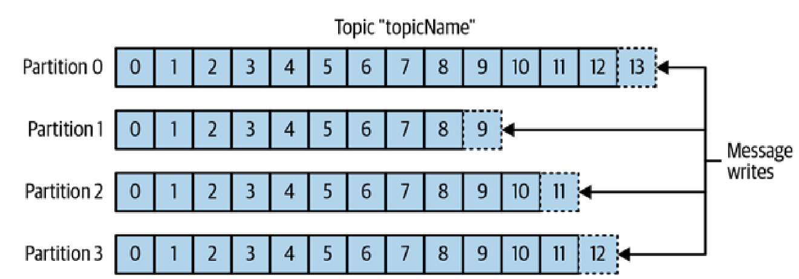

# Message Broker

Что такое брокер сообщений?
Зачем нужен брокер сообщений?
Апачи кафка как брокер сообщений
RabbitMQ как брокер сообщений
Сравнение RabbitMQ и apache Kafka

# Глава 1. Брокер сообщений

В этой главе я опишу для чего нужен брокер сообщений в асинхронной комуникации и разновидности брокеров сообещний. Так же я проведу сравнение нескольких брокеров сообещний. Но для начала придется упомянуть, что такое монолитная и микросервисная архитектура.

## 1.1 Монолитная архитектура

Монолитная архитектура подразумевает наличие одной общей платформы, где находятся все компаненты одной программы. Значит, что все компаненты взаимосвязанны и взаимозаменяемые. Микросервисная архитектура подходит для разработки малых приложений. Монолитное приложение всегда полностью упаковано в один файл, который запустит целое приложение.

### 1.1.1 Преимущества монолитной архитектуры

 - Простота разработки. 

 - Легко вносить радикальные изменения.

 - Простота теститирования.

 - Простота развертывания (deploy)

 - Легкость масштабирования (esay to scale). 

### 1.1.2 Недостатки монолитной архитектуры

 - Большое приложение перегружает и замеляет IDE

 - Deploy часто бывает раз в месяц. Сливание кода занимаем много времени и потом идет долгий процесс тестирования и стабилизации кодовой базы

 - Тестирование так же проходит долго, потому что сервер и разработчики часто незамечают изменений из-за их неочевидности

 - Трудности с масштабированием (scale). Это занчит, например, что одна часть приложения может требовать большой объем оперативной памяти, а друга требует модуль обработки изображений. Поэтому разработчика часто приходиться идти на компромисс при выборе серверной конфигурации. 

 - Монолитная архитектура часто ненадежная, потому что большое приложение тяжело полностью протестровать.

 - Зависимость от старых технологий. Большое приложение тяжело переписать с использованием новых технологий

## 1.2 Микросервисная архитектура

Микросервисная архитектура разделяет приложение на слабосвязанные сервисы, у которых есть своя собственная логика и база данных. 

### 1.2.1 Преимущества микросервисной архитектуры

 - Непрерывная доставка и развертывание крупных, сложных приложений (Continuous delivery and deployment of large, complex application)

 - Сервисы небольшие и простые в обслуживании

 - Сервисы масштабируются независимо друг от друга. (services are indpendently scalable)

 - Лучшая изоляция неполадок. (Better fault isolation)

 - Легко внедрять новые технологии 

### 1.2.2 Недостатки микросервисной архитектуры

 - Сложно подобрать подходящий набор сервисов, которые будет развертываться независимо

 - Распределенные системы сложные в разработке, потому что сервисы должны использовать механизм межпроцессного взаимодействия. Так же сервисы должны быть способны справиться с частичными сбоями.
 <!-- - Сложность распределенных систем (Distributed system are complex) -->

## 1.3 Асинхронная комуникация

Асинхронная комуникация подразумевает собой связь Producent - Konzument между сервисами. Продуцент отравляет запрос, а сервис отвечает асинхронно, то есть клиент не блокируется на время ожидания ответа и продолжает свою работу. Приложения, использующие асинхронные комуникации, обычно используют брокер сообщений, который играет промежуточную роль между сервисами. Так же сервисы могут общаться напрямую друг к другу без брокера сообщений.

## 1.4 Обмен сообщений с брокером сообщений

Как я уже говорили брокер выступает посредником между сервисами. Отправитель передает сообщение брокеру, а брокер доставляет это сообщение получателю. Брокер сообщений гарантирует, что сообщение будет доставлено от одного сервиса другому.  Так же задачей брокера является: 
 - проверка сообщений на ошибки 
 - маршрутизация конкретному получателю 
 - разбиение сообщений на несколько маленьких, с последующим агрегированием ответов и оптравкой результата отправителю
 - сохранение сообщений в базе данных; вызов веб-сервисов. 
 Рассмотрю два популярных брокера сообщений у которых разная реализация, но сначала расскажу о преимуществах и о недостатках обмена сообщений использую брокера сообщений.

### 1.4.1 Преимущества обмена сообщений с брокером сообщений

 - _Слабая связанность_. Отправитель отправляет сообщение в подходящий канал и ничего не знает о получателях.

 - _Буферизация сообщений_ Все сообщения храняться в очереди до тех пор, пока потребитель не будет готов их принять. Это значит что система может принимать сообщения дальше, несмотря на то, что другой сервис загружен.

### 1.4.2 Недостатки обмена сообщений с брокером сообщений

 - _Потенциальная единная точка отказа_ (Potentional single point of failure). Если брокер не будет высокодоступным, то может пострадать надежность системы.

 - _Дополнительная сложность в администрировании_ (Additional operational complexity) Брокер сообщений - это системный компанент, который нужно устанавливать, конфигурировать и администрировать.

 ## 1.5 Apahce Kafka

 Apache kafka распределенная и легко масштабируемая система обмена сообщениями с высокой пропускной способностью, которая может в режиме реального времени обрабатывать любые объемы данных.

 Kafka посылает _сообщения_ между сервисами. Сообщения в Kafka записываются пакетами. Делается это для меньшего потребления ресурсов, во время передачи . _Пакет_ (batch) представляет собой набор сообщений, которые относятся к одной теме и к одному разделу (partitions). Сообщения распределяются по _темам_. Темы разбиваются на _разделы_. Само сообщение 

 
 

 

 ## 1.6 RabbitMQ

## Что такое брокер сообщений ?

Брокер сообщений это часть приложения которая занимается обменом сообщений между сервисами. Он помогает снять нагрузку с веб-сервиса, т.к. он не занимается пересылкой сообщений. Обмен сообщениями происходит асинхронно, что позволяет одному сервису отправить запрос брокеру сообщений, а брокер сообщений гарантирует, что сообщение бдует доставлено второму сервису. Это позволит первому сервису не ждать ответа от второго сервиса и позволит пользователю дальше пользоваться приложением без ожидания. Брокер сообщений гарантирует доставку данных от сервиса к сервису. 

Брокер сообщений представляет собой модель Producent - Konzument: _Producent_ публикует новые события в группе по определенным аттрибутам. _Konzument_ подписывается на эти события с определенным аттрибутам и обробатывает их.

## Apache Kafka
Отдельный сервер Kafka называется брокеро. Брокер получает сообщение от продуцера, присваивает им офсеты и отправляет их в дисковое хранилище.

Физические данные в Kafka хранятся на диске в виде секций (partitions). Сообщения хранятся в секциях под индексом (offset). 

Producent и Konzument указываю топик, на который они подписываются. Сообщение из одного топика может храниться в разных секциях. Consumer сам делает запрос брокеру, посылая ему номер сообщения и номер секции и он Cosumer получает данные 

<!-- Производители, формируя сообщения, прикрепляют к нему ключ и номер партиции. Номер партиции может быть выбран рандомно (round-robin), если у сообщения отсутствует ключ. -->

 
 ### Notes
 Брокеры полезны тогда, когда какие-либо действия для своего выполнения требуют много времени, потребляют много ресурсов и __НЕ__ требуют немедленного результата. Так же они упрощают координацию в микросервисной архитектуре 