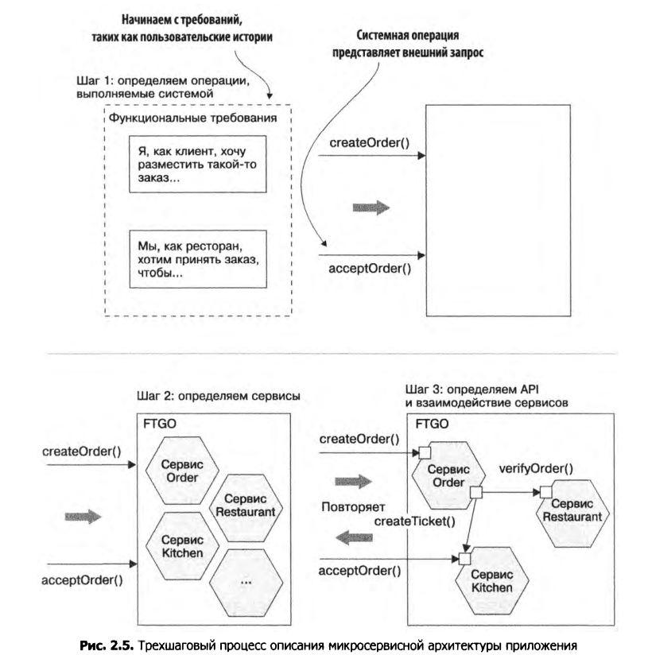
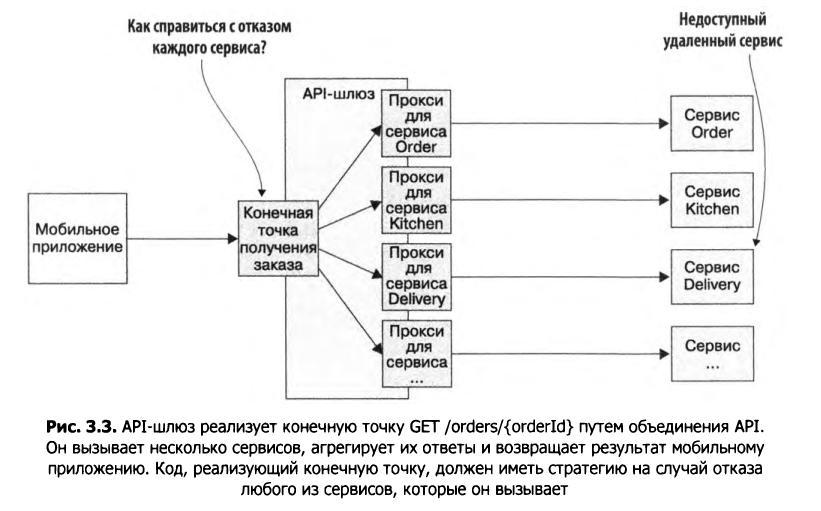
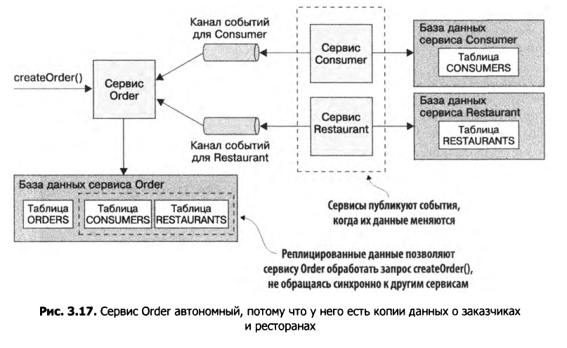
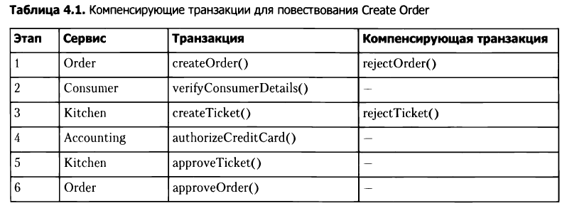
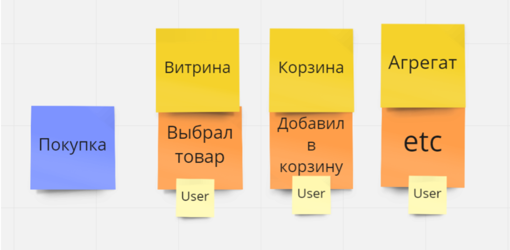

# Content:
   - [The Twelve Factor App](#the-twelve-factor-app) 
      - [12 Факторов](#12-фактров)
   - [Distributed Tracing (Распределенная трассировка)](#distributed-tracing-распределенная-трассировка)
   - [OpenTelemetry](#opentelemetry)
      - [What is Observability?](#what-is-observability?) 
      - [Metrics](#metrics) 
      - [Baggage](#baggage) 
      - [Collector](#collector) 
   - [Helm](#helm)
   - [Argo CD](#argo-cd)
   - [Istio](#istio)
   - [Terraform](#terraform)
   - [Granfana](#granfana)
      - [Granfana для веб-приложения](#grafana-для-веб-приложения-визуализирует)
      - [Granfana Loki](#granfana-loki)
   - [Монилитные приложения](#монолитные-приложения)
      - [Преимущества монолитных приложений](#преимущества-монолитных-приложений)
      - [Недостатки монолитных приложений](#недостатки-монолитных-приложений)
   - [Микросервисные приложения](#микросервисные-приложения)
      - [Преимущества микросервисных приложений](#преимущества-микросервисных-приложений)
      - [Недостатки микросервисных приложений](#недостатки-микросервисных-приложений) 
   - [Pattern: Decompose by business capability (Разложение по бизнес-возможностям)](#pattern-decompose-by-business-capability-разложение-по-бизнес-возможностям)
   - [Pattern: Decompose by subdomain (Разложение по поддоменам)](#pattern-decompose-by-subdomain-разложение-по-поддоменам)
   - [cURL](#curl)
   - [Pattern: CQRS command query responsibility segregation (Разделение ответственности командных запросов)](#pattern-cqrs-command-query-responsibility-segregation-разделение-ответственности-командных-запросов)
   - [Redis DB](#redis-db)
      - [Брокер сообщений](#брокер-сообщений)
   - [Swagger](#swagger)
   - [Keycloack](#keycloack)
      - [Single sign-on / sign-off (Технология единого входа)](#single-sign-on--sign-off-технология-единого-входа)
   - [JSON Web Token](#json-web-token)
   - [Mailgun](#mailgun)
   - [Google Maps API](#google-maps-api)
   - [Kris Richardson Microservices BOOK](#kris-richardson-microservices-book)
      
       <h4 align="center"> Глава 1. Побег из монолитного ада </h4>
      
      - [Big Ball of Mud](#big-ball-of-mud)
      - [Преимущества монолитных приложений из книги](#преимущества-монолитных-приложений-из-книги)
      - [Недостатки монолитных приложений из книги](#недостатки-монолитных-приложений-из-книги)
      - [Определение микросервисов из книги](#определение-микросервисов-из-книги)
      - [Отличие SOA (service-oriented architecture) от микросервисной архитектуры](#отличие-soa-service-oriented-architecture-от-микросервисной-архитектуры)
      - [Преимущества микросервисной архитектуры из книги](#преимущества-микросервисной-архитектуры-из-книги)
      - [Недостатки микросервисной архитектуры из книги](#недостатки-микросервисной-архитектуры-из-книги)
      - [Язык шаблонов](#язык-шаблонов)
      - [Шаблон проектирования](#шаблон-проектирования)
      - [Шаблоны взаимодействия](#шаблоны-взаимодействия)
      - [Шаблоны запрашивания данных в микр. арх.](#шаблоны-запрашивания-данных-в-микр-арх)
      - [Шаблоны наблюдаемости позволяют понять, как себя ведет приложение](#шаблоны-наблюдаемости-позволяют-понять-как-себя-ведет-приложение)
      - [4 показателя оценивающих процесс разработки](#4-показателя-оценивающих-процесс-разработки)
      - [Резюме](#резюме-глава-1)
      
      <h4 align="center"> Глава 2. Стратегии декомпизиции </h4>

      - [Определение архитектуры ПО](#определение-архитектуры-по)
      - [Модель представлений архитектуры вида 4+1](#модель-представлений-архитектуры-вида-41)
      - [Многоуровневый архит. стиль](#многоуровневый-архит-стиль)
      - [Шестигранный архит. стиль](#шестигранный-архит-стиль)
      - [Выгоды шестигранной архит.](#выгоды-шестигранной-архит)
      - [Сервис и Слабая связанность](#сервис-и-слабая-связанность)
      - [Определение микросервисной архитектуры приложения](#определение-микросервисной-архитектуры-приложения)
      - [1) Определение системных операций](#1-определение-системных-операций)
      - [2) Определение сервисо](#2-определение-сервисов)
      - [Рекомендации по декомпозиции : Принцип единнственной ответственности (Single Responsibility Principle)](#рекомендации-по-декомпозиции--принцип-единнственной-ответственности-single-responsibility-principle)
      - [Рекомендации по декомпозиции : Принцип согласованного изменения (Common Closure Principle)](#рекомендации-по-декомпозиции--принцип-согласованного-изменения-common-closure-principle)
      - [Трудности при разбиении приложения на сервисы](#трудности-при-разбиении-приложения-на-сервисы)
      - [3) Определение API сервисов](#3-определение-api-сервисов)
      - [Резюме. Глава 2](#резюме-глава-2)

      <h4 align="center"> Глава 3. Межпроцессное взаимодействие в микросервисной архитектуре  </h4>

      - [Стили взаимодействия между клиентом и сервисом](#стили-взаимодействия-между-клиентом-и-сервисом)
      - [Текстовые и двоичные форматы сообщений](#текстовые-и-двоичные-форматы-сообщений)
      - [Pattern: Взаимодействие на основе удаленного вызова процедур](#pattern-взаимодействие-на-основе-удаленного-вызова-процедур)
      - [Использование REST](#использование-rest)
      - [Преимущества REST](#преимущества-rest)
      - [Недостатки REST](#недостатки-rest)
      - [Преимущества gRPC](#преимущества-grpc)
      - [Недостатки gRPC](#недостатки-grpc)
      - [Работа с условием частичного отказа с применением Pattern: Предохранитель (Circuit breaker)](#работа-с-условием-частичного-отказа-с-применением-pattern-предохранитель-circuit-breaker)
      - [Обнаружение сервисов](#обнаружение-сервисов)
      - [Применение шаблонов обнаружения сервисов на уровне приложения](#применение-шаблонов-обнаружения-сервисов-на-уровне-приложения)
      - [Pattern: Саморегистрация](#pattern-саморегистрация)
      - [Pattern: Обнаружение на клиенской стороне ](#pattern-обнаружение-на-клиенской-стороне)
      - [Применение шаблонов обнаружения сервисов, предоставляемых платформой](#применение-шаблонов-обнаружения-сервисов-предоставляемых-платформой)
      - [Pattern: Сторонняя регистрация](#pattern-сторонняя-регистрация)
      - [Pattern: Обнаружение на стороне сервера](#pattern-обнаружение-на-стороне-сервера)
      - [Обзор механизмов обмена сообщениями](#обзор-механизмов-обмена-сообщениями)
      - [Реализация синхронных и асинхронных запросов/ответов](#реализация-синхронных-и-асинхронных-запросовответов)
      - [Реализация однонаправленных уведомлений](#реализация-однонаправленных-уведомлений)
      - [Реализация шаблона "издатель/подписчик"](#реализация-шаблона-издательподписчик)
      - [Реализация издателя/асинхронных ответов](#реализация-издателяасинхронных-ответов)
      - [Преимущества обмена сообщений без брокера](#преимущества-обмена-сообщений-без-брокера)
      - [Недостатки обмена сообщений без брокера](#недостатки-обмена-сообщений-без-брокера)
      - [Преимущества обмена сообщениями на основе брокера ](#преимущества-обмена-сообщениями-на-основе-брокера)
      - [Недостатки обмена сообщениями на основе брокера ](#недостатки-обмена-сообщениями-на-основе-брокера)
      - [Бибиблиотеки и фреймворки для обмена сообщений](#бибиблиотеки-и-фреймворки-для-обмена-сообщений)
      - [Фреймворк Eventuate](#фреймворк-eventuate)
      - [Избавление от синхронного взаимодействия ](#избавление-от-синхронного-взаимодействия)
      - [Репликация данных](#репликация-данных)
      - [Резюме](#резюме-глава-3)
      
      <h4 align="center"> Глава 4. Управление транзакциями с помощью повествований (SAGA) </h4>

      - [Использование шаблона "Повествование" для сохранения согласованности данных](#использование-шаблона-повествование-для-сохранения-согласованности-данных)
      - [Повествования, основанные на хореографии](#повествования-основанные-на-хореографии)
      - [Преимущества повествований на основе хореографии](#преимущества-повествований-на-основе-хореографии)
      - [Недостатки повествований на основе хореографии](#недостатки-повествований-на-основе-хореографии)
      - [Повествования, основанные на оркестрации](#повествования-основанные-на-оркестрации)
      - [3 Преимущества и 1 недостаток повествований, основанных на оркестрации](#3-преимущества-и-1-недостаток-повествований-основанных-на-оркестрации)
      - [Что делать с недостаточной изолированностью](#что-делать-с-недостаточной-изолированностью)
      - [Обзор аномали](#обзор-аномали)
      - [Решения аномалий](#решения-аномалий)
      - [Cтруктура повествования](#cтруктура-повествования)
      - [Резюме](#резюме-глава-4)

      <h4 align="center"> Глава 5. Проектирование бизнес-логики в микросервисной архитектуре </h4>

      -[Шаблон Агрегат](#шаблон-агрегат)
      -[Шаблон "Сценарий транзакции"](#шаблон-сценарий-транзакции)
      -[Шаблон "Доменная модель"](#шаблон-доменная-модель)
      -[Агрегаты имею четкие границы](#агрегаты-имею-четкие-границы)
      -[Правила для агрегатов](#правила-для-агрегатов)
      -[Шаблон "Доменное событие"](#шаблон-доменное-событие)
      -[Резюме](#резюме-глава-5)

      <h4 align="center"> Глава 6. Разработка бизнес-логики с порождением событий </h4>

      -[Проблемы традиционного сохранения данных](#проблемы-традиционного-сохранения-данных)
      -[Шаблон "Порождение событий" (Event Sourcing)](#шаблон-порождение-событий-event-sourcing)
      -[Улучшение производительности с помощью снимков (Snapshots)](#улучшение-производительности-с-помощью-снимков-snapshots)
      -[Идемпотентная обработка сообщений (Idempotent message processing)](#идемпотентная-обработка-сообщений-idempotent-message-processing)
      -[Плюсы и минусы шаблона порождения событий (Event Sourcing)](#плюсы-и-минусы-шаблона-порождения-событий-event-sourcing)
      -[Проблемы совместного использования саги и порождения событий](#проблемы-совместного-использования-саги-и-порождения-событий)
      -[Резюме](#резюме-глава-6)

   - [Kubernetes](#kubernetes)
      - [Image](#image)
      - [Container](#container)
      - [Node (Minions)](#node-minions)
      - [Cluster](#cluster)
      - [Master](#master)
      - [Mini-cube](#mini-cube)
      - [Pods](#pods)
      - [YAML](#yaml)
      - [Controllers](#controllers)
      - [Labels and Selectors](#labels-and-selectors)
      - [Replica Set](#replicaset)
      - [Kubernetes commands](#kubernetes-commands)

# The Twelve Factor App

Twe 12factor App — это методология для создания SaaS-приложений, которые:

(Минимум времени интеграции в проект новых разработчиков, соглашения с операционными системами, развертывание на облачных платформах, минимальное расхождение между разработкой и продакшеном, масштабирование без существенных изменений в разработке и инструментах)

 - Используют __декларативный__ формат для описания процесса установки и настройки, что сводит к минимуму затраты времени и ресурсов для новых разработчиков, подключённых к проекту;
 - Имеют __соглашение__ с операционной системой, предполагающее __максимальную переносимость__ между средами выполнения;
 - Подходят для __развёртывания__ на современных __облачных платформах__, устраняя необходимость в серверах и системном администрировании;
 - __Сводят к минимуму расхождения__ между средой разработки и средой выполнения, что позволяет использовать __непрерывное развёртывание__ (continuous deployment) для максимальной гибкости;
 - И могут __масштабироваться__ без существенных изменений в инструментах, архитектуре и практике разработки.

 ## 12 ФАКТРОВ
 --- 
 1) __Кодовая база__ Одна кодовая база, отслеживаемая в системе контроля версей - множество развертываний

     Приложение не может использовать тот же самой код что и другое приложение. Это нарушает 12 факторов. _ВЫХОД :_ выделение общего кода в библиотеки, которые потом можно подключить через [менеджер зависимостей](#Зависимости).

---

 2) __Зависимости__ Явно объявляйте и изолируйте зависимости 

    Приложение 12 факторов никогда __не зависит__ от неявно существующих, доступных по всей системе пакетов.
---

 3) __Конфигурация__ Сохраняйте конфигурацию в среде выполнения

    Иногда приложения хранят конфигурации как константы в коде. Это нарушение методологии двенадцати факторов, которая требует __строгого разделения конфигурации и кода__. Конфигурация может существенно различаться между развёртываниями, код не должен различаться.

    Лакмусовой бумажкой того, правильно ли разделены конфигурация и код приложения, является факт того, что кодовая база приложения может быть в любой момент открыта в свободный доступ без компрометации каких-либо приватных данных.

    __Приложение двенадцати факторов хранит конфигурацию в переменных окружения__ (часто сокращается до __env vars__ или __env__).  Переменные окружения легко изменить между развёртываниями, не изменяя код

 ---
 4) __Сторонние службы (Backing Services)__ Считайте стороние службы подключаемыми ресурсами

    __Код приложения двенадцати факторов не делает различий между локальными и сторонними сервисами.__ Подключение и отключение баз данных, апичек и т.д. без каких-либо изменений кода. 
 ---
 5) __Сборка, релиз, выполнение__ Строго разделяйте стадии сборки и выполнения

    _Этап сборки_ - преобразует репозиторий кода в исполняемый пакет, называемый _сборка_.
    _Этап релиза_ принимает сборку и объединяет её с текущей конфигурацией развёртывания. Релиз готов к запуска в среде выполнения
    _Этап выполнения_ запускает приложение в среде выполнения путём запуска некоторого набора процессов приложения из определённого релиза.

 ---
 6) __Процессы__ Запускайте приложение как один или несколько процессов не сохраняющих внутреннее состояние

    __Процессы приложения двенадцати факторов не сохраняют внутреннее состояние (stateless) и не имеют разделяемых данных (share-nothing)__

 ---
 7) __Привязка портов__ Экспортируйте сервисы через привязку портов

    Веб-приложение __экспортирует HTTP-сервис путём привязки к порту__ и прослушивает запросы, поступающих на этот порт.

 ---
 8) __Параллелизм__ Масштабируйте приложение с помощью процессов

    Процессы в приложении двенадцати факторов взяли сильные стороны из модели процессов Unix для запуска демонов. С помощью этой модели разработчик может спроектировать своё приложение таким образом, что для обработки различной рабочей нагрузки необходимо назначить каждому типу работы свой типа процесса.

 ---
 9) __Утилизируемость (Disposability)__ Максимизируйте надежность с помощью быстрого запуска и корректного завершения работы 

    __Приложения 12 факторов могут быть запущены и остановлены в любой момент.__ Процессы должны стараться __минимизировать время запуска__.
    
    Процессы должны __завершаться корректно, когда они получают SIGTERM__ сигнал от диспетчера процессов.

    Процессы также должны быть __устойчивыми к внезапной смерти__ в случае отказа аппаратного обеспечения. Хотя это мало вероятно, но это может случиться. И по закону подлости (_Murphy's law_) это случиться в самый неподходящий момент.

 ---

 10) __Паритет разработки/работы приложения__ 
 Держите окружение разработки,промежуточного развертывания и рабочего развертывания максимально похожими

 Различия между разработкой и работой приложения:
    
- __Различие во времени__: разработчик может работать с кодом, который попадёт в рабочую версию приложения только через дни, недели или даже месяцы.
    
- __Различие персонала__: разработчики пишут код, OPS инженеры разворачивают его.
    
- __Различие инструментов__: разработчики могут использовать стек технологий, такой как Nginx, SQLite, и OS X, в то время как при рабочем развёртывании используются Apache, MySQL и Linux.

 ---
 11) __Журналирование__ Рассматривайте журнал как поток событий

 __Приложение двенадцати факторов никогда не занимается маршрутизацией и хранением своего потока вывода__. Приложение не должно записывать журнал в файл и управлять файлами журналов. Вместо этого каждый выполняющийся процесс записывает свой поток событий без буферизации в стандартный вывод ```stdout```. Во время локальной разработки разработчик имеет возможность просматривать этот поток в терминале, чтобы наблюдать за поведением приложения

 ---
 12) __Задачи администрирования__ Выполняйте задачи администрирования/управления с помощью разовых процессов

  Разовые процессы администрирования следует запускать в среде идентичной регулярным длительным процессам приложения. Они запускаются на уровне релиза, используя те же кодовую базу и конфигурацию, как и любой другой процесс, выполняющий этот релиз. Код администрирования должен поставляться вместе с кодом приложения, чтобы избежать проблем синхронизации.

# Distributed Tracing (Распределенная Трассировка)

__Распределенная трассировка__ это метод используемый для профилирования и мониторинга приложений, особенно микросервисных. Распределенная трассировка помогает определить где происходят сбои и что вызывает низкую производительность https://opentracing.io/docs/overview/what-is-tracing/

Open Tracing __НЕ__ является загрузкой или программой. __НЕ__ является стандартом. Ее требуется добавлять в инструментарий разработчка,используя API, или в фреймворки.

Open Tracing состоит из спецификации API, фреймворков и библиотек. 


# OpenTelemetry 

__OpenTelemetry__ это набор инструментов API и SDK. Используется для обработки, генерации, сбора и экспорта данных (metrics, logs,traces), чтоб проанализировать производительность и поведение ПО.

## What is Observability? 
 Наблюдаемость позволяет нам понять систему извне, задавая вопросы об этой системе, не зная ее внутренней работы. Помогает легко устронять неполадки и решать новые проблемы и понять почему именно что-либо происходит.

 __Metrics__ - частота системных ошибок, загрузка процессора, частота запросов для данной службы.

 __SLI (Service Level Indicator)__ - оценивает наш сервис с точки зрения пользователя. Например как быстро загрузилась веб-страница
 __SLO (Service Level Objective)__ - средство, с помощью которого надеждность доводится до сведения организации.


## Metrics
Сегодня OpenTelemetry определяет три метрических инструмента:

__counter__ - он только увеличивается 

__measure__ - представляет значение в некотором определенном диапазоне 

__observer__ - фиксирует текущий набор значений (Напр. указатель уровня топлива в автомобиле)

В отличии от трассировки запросов, которые отслеживают жизненные циклы запросов и предоставляют контекст для отдельных частей запроса, метрики предоставляют статическую информацию в совокупности. 

## Baggage 

__Багаж относиться к контекстной ифне, которая передается между spans__

Багаж используется для хранения конфиденциальных данных, которые вы можете предоставить третьим лицами

Baggae != Span attributes

## Collector 

__Collector__ получает, обрабатывает и экспортирует данные телеметрии. Поддерживает прием данных в формате (OLTP, Jaeger, Prometheus а множество коммерческих инструментов) и отправку данных на один или несколько серверов. 


# Helm 
 
 Helm помогает управлять приложения Kubernetes. 
 Helm относиться к 5 этапу из 12 факторного приложение, т.е Сборка, релиз, выполнение.

 В Helm это устроенно так:
 __Chart__ - набор информации необходимой для создания инстанции Kubernetes
 __Config__ - содержит инфо о конфигурации, которую можно объединить в пакетный chart для создания объекта релиза
 __Release__ - это запущенная инстанция chart, объединенная с определенной конфигурацией (Config)


# Argo CD
 
 Argo CD - это декларативный инструмент непрерывной доставки GitOps для Kubernetes
 
 Argo CD следует шаблону GitOps, использующему репозитории Git в качестве источника среды окружения. 

 Argo Cd реализован как контроллер kubernetes, который непрерывно отслеживает запущенные приложения и сравнивает текущее состояние с желаемым целевым состоянием (Как указано в репо ГИТа). Argo CD сообщает и визуализирует различия, предоставляя при этом средства для автоматической или ручной синхронизации текущего состояние в желаемое целевое

# Istio
 
 Istio - это путь к балансировке нагрузки, аутентификации между службами и мониторингу - с небольшим кол-ом изменений кода или без них

 Istio состоит из двух компонентов: data plane and the control plane 

 __Data plane__ это связь между службами. 
 __Control plane__ принимает желаемую конфигурацию и представление служб и динамически программирует прокси-серверы, обновляя их по мере изменения правил или изменения среды.

# Terraform 

__Terraform__ - это инструмент (инфарструктура как код IaC), который позволяет безопасно и эффективно создавать, изменять и обновлять инфраструктуру. Это включает в себя как компоненты низкого уровня, такие как вычислительныее экземпляры, хранилище и сеть, так и компоненты высокого уровня, такие как записи DNS и функции SaaS.

# Granfana

 __Grafana__ — это платформа с открытым исходным кодом для визуализации, мониторинга и анализа данных. Grafana позволяет пользователям создавать дашборды с панелями, каждая из которых отображает определенные показатели в течение установленного периода времени. Каждый дашборд универсален, поэтому его можно настроить для конкретного проекта или с учетом любых потребностей разработки и/или бизнеса.

 ## Grafana для веб-приложения визуализирует:
  - версию приложения
  - уникальный идентификатор каждого запроса
  - время отклика и статус
  - код ошибки 
  - IP-адрес, с которого был отправлен запрос
  - инфо о пользователе 
  - устройство и т.д.

# Granfana Loki 
 __Loki__ это система агрегации логов, предназначенная для хранения и запроса логов из всех приложений и инфраструктуры.

 Loki использует уникальный подход, __индексируя только метаданные__, а не полный текст строк лога.


# Монолитные приложения

 ## Преимущества монолитных приложений
  - Простота разработки
  - Простота развертывания - у вас всего один файл (WAR, JAR etc.)
  - Простота масштабирования - вы можете масштабировать приложение, запустив несколько копий приложения за балансировщиком нагрузки

 ## Недостатки монолитных приложений
  - Большая кодовая база пугает разработчиков, особенно еще зеленых бойцов. Из-за этого разработка замедляется. Модульность размывается со временем 
  - Чем больше кода, тем медленее среда разработки и менее продуктивны разработчики
  - Перегруженный веб-контейнер загружается все больше и больше времени
  - Непрерывное развертывание становиться все более и более сложным
  - Масштабирование приложения становитья сложным. Монолит может масштабироваться только в одном измерении. Мы не можем масштабировать каждый компонент независимо
  - Мы не можем работать независимо разными командами над приложением 
  - Долгое использование конкретного стека технологий иногда даже и версий технологий.

# Микросервисные приложения 

 ## Преимущества микросервисных приложений
 - Обеспечивает непрерывную доставку и развертывание больших и сложных приложений (Каждую часть легче починить, сервисы меньше и быстрее тестируются, службы могут быть развернуты независимо)
 - Разработчику легче понять относительное малые микросервисы, нежели большой монолит, IDE работает быстрее, что делает разработчиков более продуктивными, ускоряется развертывание
 - Улучшенная изоляция сбоев. Напр. : если в одной службе утечка памяти, то это никак не влияет на другую службу
 - Можно использовать новые стеки и технологии 


 ## Недостатки микросервисных приложений
 - Программисты должны внедрить связь между всеми процессами и справиться с частичным отказом 
 - Сложнее реализовать запросы, охватывающие несколько служб
 - Тестирование между службами сложнее
 - Реализация запросов, охватывающих несколько служеб, требует тщательной координации между командами
 - Сложность развертывания
 - Увеличенное потребление памяти

# Pattern: Decompose by business capability (Разложение по бизнес-возможностям)

Определение услуг, соответствующие бизнес-возможностям. Бизнес-возможности напр. _Управление заказами_ отвечает за заказы; _Управление клиентами_ несет ответственность за клиентов 

## Преимущества
 - Стабильная архитектура
 - Услуги являются целостными и слабо связанными 

## Проблемы
- __Как определить бизнес-возможности?__ Они определяются путем анализа цели, структуры, бизнес-процессов и областей компетенции организации.  Отправными точками для определения бизнес-возможностей являются: 
   1. организационная структура - различные группы внутри организации могут соответствовать бизнес-возможностям или группам бизнес-возможностей
   2. модель домена высокого уровня - бизнес-возможности часто соответсвуют объектам домена 

# Pattern: Decompose by subdomain (Разложение по поддоменам)

 Каждый домен состоит из нескольких поддоменов:
  - Ядро - ключевое отличие для бизнеса и наиболее ценная часть приложения 
  - Поддержка - связана с тем, что делает бизнес, но не является отличительной чертой. 
  - Общие -  не специфичны для бизнеса и в идеале реализуются с использованием готового программного обеспечения

## Преимущества
 - Стабильная архитектура, поскольку поддомены относительно стабильны
 - Команды разработчиков многофункциональны, автономны и организованы вокруг предоставления бизнес-ценности
 - Сервисы являются взаимосвязанными и слабо связанными

## Проблемы
 - __Как определить поддомены?__ Здесь требуется понимание бизнеса.Хорошими отправными точками для определения поддоменов являются:

  1. структура организации - поддоменам могут соответствовать разные группы внутри организации
  2. модель домена высокого уровня - поддомены часто имеют ключевой объект домена 

# cURL
   __cURL__ помогает делать сетевые запросы по протоколам _HTTP,FTP,SCP_

# Pattern: CQRS command query responsibility segregation (Разделение ответственности командных запросов)
   Реализует запрос, которому нужны данные из нескольких сервисов. Она задействует одно или несколько представлений базы данных.

   Объединение API хорошо подходит для реализации многих запросов, которые должны извлекать данные из разных сервисов. __Но__ в микросервесной архитектуры это лишь частичное решение. Есть запросы, которые нельзя эффективно объединить. Так же возможны трудности с тем, что запросы не выходят за пределы одного сервиса.

   CQRS решает следующие проблемы :
   - Объединение АПИ приводит к малоэффективным операциям join выполняемых в памяти 
   - Сервис, владеющий данными, хранит их в формате или базе данных, которые не имеют эффективной поддержки нужного запроса 
   - Необходимость CQRS означает, что реализацией запроса не должен заниматься сервис, который владеет данными

   CQRS работает так, что создает (Командную) БД для создания, обновления и удаления (POST, PUT, DELETE). Другую - для запросов; она поддерживается в актуальном состоянии с помощью событий, которые публикуются при каждом изменении в БД командной стороны

   У сервиса есть обработчики, которые подписываются на события, публикуемые несколькими сервисами, и обновляют базу данных привязаной к этому сервису.

   ## Преимущества
   - Возможность эффективной реализации запросов в мик. арх.
   - Возможность эффективной реализации разнородных запросов
   - Возможность выполнения запросов в приложении, основанном на порождении событий
      
         Хранилище событий поддерживает только запросы по первичному ключу. CQRS устраняет эту проблему, создавая для агрегатов одно или несколько представлений(VIEW) поддерживаемых в актуальном состоянии 
   
   - Улучшеное разделение ответсвтенности  

   ## Недостатки 
   - Более сложная архитектура
   - Отставание репликаций 

         Как можно было бы ожидать, между публикацией события командной стороной, его обработкой запрашивающим сервисом и обновлением представления проходит некоторое время. Клиентское приложение, которое обновляет агрегат и сразу же обращается к представлению, может получить предыдущую версию агрегата
   
   ВЗЯТО ИЗ : __КРИС РИЧАРДСОН МИКРОСЕРВИСЫ ПАТТЕРНЫ РАЗРАБОТКИ И РЕФАКТОРИНГА__

# Redis DB

   __Redis__ ситема управления БД класса NoSQL, работающая со структурами данных типа "ключ-значение". Используется как БД, так и для реализации кешей, брокеров сообщений

   - Особенности:
   Поддерживает типы String, Bitmap, Bitfield, Hash, List, Set, Sorted Set, Geospatial, HyperLogLog, Stream
   
   Макс. производительность 100 тыс. SET GET запросов.
   
   Она работает в оперативной памяти и есть возможность хранения данных на жестких дисках, благодаря, механизму снимков и журналирования

   Redis состоит из ведущего и подчиненных узлов. Это помогает справиться с отказами. Помогает простроить надежную линию связи и исключает потерю данных при их передече от ведущего узла к подчиненному. 

## Брокер сообщений

   __Брокер сообщений__ - архитектурный паттерн в распределительных системах; приложение которое преобразует сообщение по одному протоколу от приложения-источника в сообщение протокола приложения-приемника, тем самым выступая между ними посредником.

# Swagger

   __Swagger__ фреймворк для спецификации RESTfull API. Дает не только интерактивно просматривать спецификацию, но и отправлять запросы через Swagger UI

# Keycloack
   __Keycloack__ продукт для реализации _single sign-on_ с возможностью управления доступом. Целью инструмента является сделать создание безопасных приложений и сервисов с мин написанием кода для аутентификации и авторизации.

   Функции:
   
   - Регистрация пользователей
   - Авторизация через соц.сети
   - Single Sign-On / Sign-Off
   - Выдача JSON Web Token подлинности аккаунтам
   - Двухфакторная аутентификация

   Состоит из:
   
   - Сервера
   - Адаптера для приложения 

## Single sign-on / sign-off (Технология единого входа)
   Технология при использовании которой пользователь переходит из одного раздела портала в другой, либо из одной системы в другую, не связанную с первой, без повторной аутентификации.

## JSON Web Token
   Как правило, используется для передачи данных для аутентификации в клиент-серверных приложениях. Токены создаются сервером, подписываются секретным ключом и передаются клиенту, который в дальнейшем использует данный токен для подтверждения своей личности.

# Mailgun
   __Mailgun__ — это эффективный SaaS-сервис для автоматизации электронной почты, обладающий пользовательским интерфейсом. В комплект поставки входят мощные API, средства мониторинга электронной почты и журналы с возможностью поиска. 
   Mailgun обеспечивает 99,9% безотказной работы в соответствии с SLA, что гарантирует надежность и круглосуточную поддержку пользователей. Платформа позволяет:

   - Кодировать систему для работы с большими объемами электронной почты;
   - Извлекать важные данные из электронной почты;
   - Включать автоматизацию электронной почты в существующую инфраструктуру.

   Благодаря поисковым журналам пользователи могут отслеживать, что происходит с электронной почтой.

# Google Maps API

   __Google Maps API__ - это набор интерфейсов, который позволяет клиенту взаимодействовать с интегрированными сервисами.

   Google Maps API Web Services возвращает сообщения с помощью __json__ и __xml__ 

   __Maps Embed API__ - с помощью простого HTTP-запроса, состоящего только из URL-адреса и параметров. 
   Разместите интерактивную карту или панораму Street View на своей веб-странице с помощью Maps Embed API. Используйте простой HTTP-запрос; JavaScript не требуется.
   Также рисует маршрут между двумя или более указанными точками на карте с указанием расстояния и времени в пути, используя различные виды транспорта: пешком, на машине, на велосипеде, на общественном транспорте и на самолете.

   __Geocoding__ - это процесс преобразования адресов (например, «1600 Amphitheatre Parkway, Mountain View, CA») в географические координаты (например, широта 37,423021 и долгота -122,083739), которые можно использовать для размещения маркеров на карте или позиционирования карты.
   __Reverse geocoding__ -


# Kris Richardson Microservices BOOK

   <h1 align="center"> Глава 1. Побег из монолитного ада </h1>   

   Монолит состоит из одного WAR файла (Web Application Archive)

## Big Ball of Mud 
   Big Ball of Mud (Большой комок грязи) - это антипаттерн с нераспозноваемой архитектурой. Существует из-за давления бизнеса, текучки кадров среди разработчиков и энтропии кода. 

## Преимущества монолитных приложений из книги
   - Простота разработки
   
   - Легкость внесения радикальных изменений 
   
   - Простота тестирования 
   
   - Простота развертывания - у вас всего один файл (WAR, JAR etc.)
   
   - Простота масштабирования - вы можете масштабировать приложение, запустив несколько копий приложения за балансировщиком нагрузки

## Недостатки монолитных приложений из книги
   - Замедляется *разработка* приложения. Большое приложение перегружает и замедляет IDE. Сборка кода занимает много времени.
   
   - *Развертывание* приложений редко может быть чаще чем раз в месяц. Работа над одной кодовой базой лишь замедляет работу. Тут даже не поможет делить таски между командами и пушить их в разные ветви. Это выльется в затяжные и мучительные слияния кода. Потом следует долгий процесс тестирования и стабилизации кодовой базы.
   
   - *Тестирование*. Внесенные изменения часто бывают неочевиднемы и незаметными, что серверу и разработчикам приходиться выполнять весь набор тестов. Значительное время затрачивается на диагностику и исправление причин проваленных тестов.

   - *Трудности с масштабированием*. Требуются разные базы данных для обработки разных данных. И разработчики идут на компромисс выбирая один тип базы данных. Значит что-то работает быстро, а что-то медленно. _Пример_: хранение данных о ресторане требует большой объем оперативной памяти, а модуль обработки изображений сильно нагружает ЦПУ.

   - *Ненадежность*. Приложение часто падет из-за ошибок.

   - *Зависимость* от старого стека технологий

## Определение микросервисов из книги 

   - *Микросервисная архитектура* это практичная трехмерная модель масштабирования в виде куба с 3 осями. Масштабирование по оси X, Y, Z

      __Масштабирование по оси X распределяет запросы между несколькими экземплярами__ - Запускает несколько экземпляров программы, размещенных за балансировщиком нагрузки. отличный способ улучшить мощность и доступность приложения.

      __Масштабирование по оси Z направляет запросы в зависимости от их атрибутов__ - Работает *ПОЧТИ* как и масштабирование по оси Х. Маршрутизатор, выставленный впереди, задействует атрибут запроса, чтобы направить его к подходящему экземпляру. Для этого, к примеру, можно использовать поле userid.

      __Масштабирование по оси Y разбивает приложение на сервисы с разными функциями__ Это просто функциональная декомпозиция. Решает проблему усложнения кода и процесса разработки.
      Разбиение запроса по типам, и с помощью банасировщика нагрузки выбор нужного экземпляра сервиса. *Например* - у нас есть сервисы Order, Customer, Review. Которые принимяют запросы типа Order, Customer, Review. Мы получили запрос типа Order, Отправили его на сервис Order. Через балансировщика нагрузки передали его к экземпляру сервиса Order.

      __Сервис__ - это мини-приложение, реализующее узкоспециализированные функции, такие как управление заказами, управление клиентами и т.д. 

      __У каждого сервиса есть своя база данных__. Сервисы взаимодействуют через АПИ

## Отличие SOA (service-oriented architecture) от микросервисной архитектуры

   **Параметр** | **SOA** | **Микросервисы**
   :--- | :---| :---|
   Межсервисное взаимодействие | Умные каналы, такие как сервисная шина, с использованием тяжеловесных протоколов по типу SOAP и других веб-сервисных стандартов | Примитивные каналы, такие как брокер сообщений, или прямое взаимодействие между сервисами с помощью легковесных протоколов таких как REST API  |
   Данные | Глобальная модель данныхи общие БД | Отдельные модель данных и БД для каждого сервиса |
   Типовой сервис  | Крупное монолитное приложение | Небольшой сервис |

## Преимущества микросервисной архитектуры из книги
   - Непрерывная доставка и развертывание крупных, сложных приложений.
   В этом помогают три свойста:
      - Микр. арх. обеспечивает уровень тестируемости, необходимый для непрерывной доставки и развертывания
      - Микр. арх. обеспечивает уровень развертываемости, необходимый для непрерывной доставки и развертывания
      - Микр. арх. позволяет сделать командыразработчиков автономными и слабо связанными между собой. 

   - Сервисы небольшие и простые в обслуживании.
   - Сервисы развертываются независимо друг от друга.
   - Сервисы масштабируются независимо друг от друга.
   - Появляется автономность команд разработчиков
   - Позволяет внедрять новые технологии 
   - Лучше изолированы неполадки 

## Недостатки микросервисной архитектуры из книги
   - Сложно подобрать подходящий набор сервисов
      _Если вы неправильно разделили систему, у вас получится распределенный монолит — набор связанных между собой сервисов, которые необходимо развертывать вместе. Распределенному монолиту присущи недостатки как монолитной, так и микросервисной архитектуры._

   - Сложность распределенных систем затрудняет разработку, тестирование и развертывание
   - Развертывание функций, охватывающих несколько сервисов, требует тщательной координации.
   - Решение о том, когда следует переходить на микросервисную архитектуру, является нетривиальным.

## Язык шаблонов
   __Язык шаблонов__ — это набор шаблонов проектирования, которые решают проблемы в определенной области. Хороший способ описания архитектурных и проектировочных методик и помогает принять решение. 

## Шаблон проектирования 
   __Шаблон проектирования__ - это многоразовое решение проблемы, возникающей в определенном контексте.

## Шаблоны взаимодействия
   Важную роль в этой архитектуре играет межпроцессное взаимодействие. Вам придется принять ряд архитектурных решений о том, как ваши сервисы будут взаимодействовать друг с другом и с внешним миром. Эти шаблоны деляться на 5 типов:
   - _Стиль взаимодействия._ Какой механизм IPC использовать ? 
   - _Обнаружение._ Каким образом клиент сервиса узнает его IP-адрес, чтобы например, выполнить НТТР-запрос?
   - _Надежность._ Обеспечение надежного взаимодействия между сервисами, даже если некоторые не будут доступны
   - _Транзакционный обмен сообщениями._ Интеграция отправки сообщений и публикация событийй с транзакциями баз данных, которые обновляют бизнес-информацию
   - _Внешний API._ Каким образом клиенты вашего приложения взаимодействуют с сервисами ?

## Шаблоны запрашивания данных в микр. арх.
   - Объединенный АПИ
   - CQRS
## Шаблоны наблюдаемости позволяют понять, как себя ведет приложение
   - _API проверки работоспособности_
   - _Агрегация журналов_
   - _Распределеная трассировка_
   - _Отслеживание исключений_
   - _Показатели приложения_
   - _Ведение журнала аудита_
## 4 показателя оценивающих процесс разработки
   - _Частота развертывания._ Как часто ПО развертывается в промышленой среде
   - _Время выполнения._ Время между регистрацией изменения и его развертыванием
   - _Среднее время восстановления._ Время восстановления после промышленного сбоя
   - _Частота неудачных изменений._ Процент изменений, которые приводят к проблемам в промышленной среде.

## Резюме. Глава 1
   1. В соответствии с монолитной архитектурой приложение структурируется в виде единой развертываемой сущности.

   2. В микросервисной архитектуре система разбивается на независимо развертываемые сервисы, каждый со своей базой данных.
   
   3. Монолитная архитектура подходит для простых приложений, а микросервисы обычно являются лучшим решением для крупных, сложных систем.

   4. Микросервисная архитектура ускоряет темп разработки программного обеспечения, позволяя небольшим автономным командам работать параллельно.
   
   5. Микросервисная архитектура не панацея. У нее есть существенные недостатки, такие как повышенная сложность.
   
   6. Язык шаблонов микросервисной архитектуры — это набор методик, которые облегчают проектирование приложений на основе микросервисов. Он помогает решить, следует ли использовать микросервисную архитектуру, и, если она вам подходит, эффективно ее применять.
   
   7. Для ускорения доставки программного обеспечения одной микросервисной архитектуры недостаточно. Чтобы разработка оказалась успешной, вам также нужно задействовать DevOps и сформировать небольшие автономные команды.
   
   8. Не забывайте о человеческом факторе перехода на микросервисы. Чтобы он стал успешным, следует учитывать эмоциональный настрой работников.

   <h1 align="center"> Глава 2. Стратегии декомпизиции </h1>

## Определение архитектуры ПО
   __Архитектура приложения__ - это его декомпозиция на части и связи между ними. 

## Модель представлений архитектуры вида 4+1
   _Модель 4+1_ определяет четыре разных представления архитектуры программного обеспечения. Каждое из них описывает определенный аспект архитектуры и состоит из конкретного набора программных элементов и связей между ними.

   <div align="center"> </div>

   1. _Логическое представление_ (**ЧТО СОЗДАЮТ РАЗРАБОТЧИКИ**) - программные элементы, создаваемые разработчиками. В ООП это классы и пакеты включая связи между ними

   2. _Представление реализации_ (**ЧТО ГЕНЕРИРУЕТ СИСТЕМА СБОРКИ**) - результат работы сборки системы. Состоит из модулей (JAR-файл) и компонентов (WAR-файл или JAR-файл). Связь между ними это зависимость между модулями и тем, какие компоненты объединены в тот или иной модуль

   3. _Представление процесса_ (**ЗАПУЩЕННЫЕ КОМПОНЕТЫ**)- компоненты на этапе выполнения. Состоит из процессов и мепроцессным взаимодействием

   4. _Развертывание_ (**ПРОЦЕССЫ, ЗАПУЩЕННЫЕ НА "УСТРОЙСТВАХ"**) - элементы состоят из серверов и процессов. Связи между серверами это сеть. Она так же описывает отношение между процессами и устройствами

   5. (+1 К модели) _Сценарий_ (**ОЖИВЛЯЕТ ПРЕДСТАВЛЕНИЯ**) - Каждый сценарий описывает, как различные архитектурные компоненты внутри конкретного представления взаимодействуют между собой, чтобы обработать запрос. 
   
## Многоуровневый архит. стиль 
   __Многоуровневый архит. стиль__ - это стандарт. В большинстве своем состоит из 3 уровней:
   - Уровень _представления_ - содержит код, реализующий пользовательский интерфейс или внешние АПИ
   - Уровень бизнес-логики - содержит бизнес-логику
   - Уровень хранения данных - реализует логику взаимодействия с базой данных

   __Недостатки__:
   - _Единый уровень представления_ — не учитывает того, что приложение, скорее всего, будет вызываться более чем одной системой.
   - _Единый уровень хранения данных_ — не учитывает того, что приложение, скорее всего, будет взаимодействовать более чем с одной базой данных.
   - _Уровень бизнес-логики зависит от уровня хранения данных_ — теоретически эта зависимость не позволяет тестировать бизнес-логику отдельно от базы данных.

## Шестигранный архит. стиль
   __Шестигранный архит. стиль__ - помогает преодолеть недостатки 3-ех уровнего стиля.
   Здесь бизнес-логика оказывается в центре, у приложения есть один или несколько _входящих адаптеров_, которые обробатывают внешние запросы путем бизнес логики. Вместо БД используются несколько _исходящих адаптеров_, которые вызываются бизнес-логикой и обращаются к внешним приложениям

   У бизнес-логики есть один или несколько портов. __Порт__ определяет набор операций и то, как и в чем бизнес-логика взаимодействует с внешним кодом
   В Java, например, портом часто является Java-интерфейс.
   
   Пример входящщего адаптера:
   - _Контроллер Spring MVC_
   - _Клиентский брокер_ 

   Пример исходящего адаптера:
   - DAO
   - Прокси класс, вызывающи внешний сервис.

   __Интерфейс репозитория определяет набор операций для доступа к данным__

## Выгоды шестигранной архит.
   1. Адаптеры отделают бизнес-логику от логики представления и доступа представления к данным и делают ее независимой
   2. Более точно отражает архит. современных приложений

## Сервис и Слабая связанность
   __Сервис__ - это автономный, независимо развертываемый программный компонент, который реализует определенные полезные функции

   __Слабая связанность__ - все взаимодействия с сервисом происходит через API, инкапсулирующий подробности его реализации. Это позволяет изменять внутренее содержание сервиса, не затрагивая его клиентов. Слабо связанные сервисы проще изменять, тестировать и проще в них разобраться.

## Определение микросервисной архитектуры приложения

   <div align="center"> </div>


## 1) Определение системных операций
   1. Создаем обобщеную доменную модель, состояющую из ключевых классов, которые предоставляют словарь для описания системных операций. 
   
   Доменная модель составляется в основном из имен _существительных_, взятых из пользовательских историй, а системные операции — в основном из _глаголов_.

   2. Определение запросов, которые приложение должно обработывать. 
   
   Системные операции бывают 2 типов:
   - _команды_ - сис. опер. для создания, обновления и удаления данных
   - _запросы_ - сис. опер. для чтения (запрашивания) данных

   Хорошей отправной точкой для определения системных команд будет анализ глаголов в пользовательских историях и сценариях.

   3. Определение системных операций 

## 2) Определение сервисов
   1. __Разбиение на сервисы по бизнес-возможностям__

   Бизнес-возможности организации описывают то, _чем_ она является.  Обычно они стабильны, в отличие от того, _как_ организация ведет свой бизнес. __Например:__ раньше чтоб вложить бабки с чека на счет, требовалось их передать кассиру. Потом это можно было сделать через банкомат. Теперь можно это сделать через смартфон. Бизнес-возможность "депонирование счета" осталась неизменной, а вот способ изменился координально. 

   2. Определившись с бизнес-возможностями, мы описываем сервис для каждой из них или для групп связанных между собой возможностей. 

   1. __Разбие на сервисы по проблемным областям__
   DDD определяет отдельную доменную модель для каждого поддомена. Поддомен является частью домена, то есть проблемной области приложения в терминологии DDD.

   Разбиение на поддомены происходит по тому же принципу, что и определение бизнес-возможностей: путем анализа работы бизнеса и определения разных областей знаний.

   DDD почти идеально сочетается с микросервисной архитектурой. Концепции поддоменов и изолированных контекстов, применяемые в DDD, прекрасно соотносятся с  микросервисами.

## Рекомендации по декомпозиции : Принцип единнственной ответственности (Single Responsibility Principle)
   __Принцип единственной ответственности__ гласит следующее: _у класса должна быть только одна причина для изменения_

## Рекомендации по декомпозиции : Принцип согласованного изменения (Common Closure Principle)
   __Принцип согласованного изменения__ гласит следующее: _причины изменения классов, входящих в один пакет, должны быть одинаковыми. Изменение пакета должно затрагивать все его классы_

## Трудности при разбиении приложения на сервисы

   - __Латентность сети.__ Можем обнаружить, что определенный вид декомпозиции вынуждает сервисы часто обмениваться данными. Это может исправить пакетный API для извлечения нескольких объектов за один вызов.
   - Ухудшение доступности из-за синхронного взаимодействия 
   - Поддержание согласованности данных между сервисами. __Решение__ последовательность локальных транзакций. 
   - Получение согласованного представления данных. __Редкая проблема__
   - Божественнные классы, препятстсвующие декомпозиции. __Решение__ упаковка класса в библиотеку и создание центральной базы данных. 
   __НО__ это нарушение ключевых принципов микросерв. архит. 
   
   __Второе решение__ инкапсуляция БД в одноименный сервис, которые другие сервисы вызывают для получения и обновления заказов. 
   __НО__ в результате этот сервис отвечал бы только за данные и имел слабую доменную модель с мин. кол-ом БЛ или вовсе без нее.
   __Третье решение__ применение DDD и восприятие каждого сервиса как отдельного поддомена со своей доменной моделью. 

## 3) Определение API сервисов

   Операция в API может существовать по одной из двух причин: 
   - _она либо соответствует системной операции и вызывается внешними клиентами (или, возможно, другими сервисами)_
   - _либо поддерживает взаимодействие между сервисами и вызывается только ими_

   Первое, что нужно сделать при определении API, — привязать системную операцию к сервису.

## Резюме. Глава 2
   
   - Архитектура определяет качественные характеристики приложения, влияющие непосредственно на темпы разработки: поддерживаемость, тестируемость и развертываемость.
   
   - Микросервисная архитектура — это архитектурный стиль, который делает приложение хорошо поддерживаемым, тестируемым и развертываемым.
   
   - Сервисы в микросервисной архитектуре организованы вокруг бизнес-аспектов (бизнес-возможностей или поддоменов), а не технических характеристик.

   - Существует два вида декомпозиции.
     - Декомпозиция по бизнес-возможностям, которая берет начало в бизнес-архитектуре.
     - Декомпозиция по поддоменам, основанная на предметно-ориентированном проектировании.
   
   - Вы можете избавиться от божественных классов, которые приводят к запутанным зависимостям и препятствуют декомпозиции, применяя DDD и определяя отдельную доменную модель для каждого сервиса.


   <h1 align="center"> Глава 3. Межпроцессное взаимодействие в микросервисной архитектуре  </h1>

   Как исправлять версию пакетов.
   Согласно спецификации семантического версионирования (Semver) номер версии должен состоять из трех частей: __MAJOR.MINOR.PATCH__. Каждая часть должна инкрементироваться следующим образом:

   - __MAJOR__ - при внесении в API несовместимого изменения;
   - __MINOR__ - при изменении API с сохранением обратной совместимости;
   - __PATCH__ - при исправлении ошибки с сохранением обратной совместимости.

## Стили взаимодействия между клиентом и сервисом

   **Параметр** | **Один к одному** | **Один ко многим**
   :--- | :---| :---|
   Синхронное | Запрос/ответ | - |
   Асинхронное | Асинхронный запрос/ответ, одноправленные уведомления | Издатель/подписчик, издатель/асинхронные ответы |

   __ПЕРВЫЙ УРОВЕНЬ__

   __Один к одному__ - каждый клиентский запрос обрабатывается ровно одним сервисом

   __Один ко многим__ - каждый запрос обрабатывается несколькими сервисами.

   __ВТОРОЙ УРОВЕНЬ__

   __Синхронное__ - клиент рассчитывает на своевременный ответ от сервиса и может заблакироваться на время ожидания

   __Асинхронное__ - клиент не блокируется, а ответ, если таковой придет, может быть отправлен не сразу

   __ВЗАИМОДЕЙСТВИЯ ОДИН К ОДНОМУ__

   _Запрос/ответ_ - клиент отправляет сервису запрос и ждет ответа. Он рассчитывает на то, что ответ придет своевременно, и может даже заблокироваться на время ожидания. Этот стиль взаимодействия обычно приводит к жесткой связанности сервисов.

   _Асинхронный запрос/ответ_ — клиент отправляет запрос, а сервис отвечает асинхронно. Клиент не блокируется на время ожидания, поскольку сервис может долго не отвечать.

   _Однонаправленные уведомления_ — клиент отправляет сервису запрос, не ожидая (и не получая) ничего в ответ

   __ВЗАИМОДЕЙСТВИЯ ОДИН КО МНОГИМ__
   
   _Издатель/подписчик_ — клиент публикует сообщение с уведомлением, которое потребляется любым количеством заинтересованных сервисов.
   _Издатель/асинхронные ответы_ — клиент публикует сообщение с запросом и ждет определенное время ответа от заинтересованных сервисов.

         Очень важно ничинать разработку с описывания интерфейса. Затем идет рассмотрение полученных результатов с клиентскими разработчиками. И только после окончания работы на API реализуете сам сервис.

## Текстовые и двоичные форматы сообщений
   Между процессами существует обмен сообщений. 
   
   К текстовому формату относятся JSON, XML. Их невыгода в том, что сообщения получаются довольно объемными, особенно если использовать XML.
   
   К двоичному формату относится Protocol Buffers и Avro. _Protocol Buffers_ задействует маркированные поля. _Aviro_ должен знать спецификацию сообщения, чтоб его итерпретировать. В итоге  _Protocol Buffers_ делает развитие API проще по сравнению с Avro.

## Pattern: Взаимодействие на основе удаленного вызова процедур 

   При помощи механизма удаленного вызова процедур (remote procedure invocation, RPI) клиент отправляет запрос сервису, а тот его обрабатывает и возвращает ответ. Некоторые клиенты могут блокироваться в ожидании ответа, а другие поддерживают реактивную, неблокирующую архитектуру.

   __УДАЛЕННЫЙ ВЫЗОВ ПРОЦЕДУР__ - Клиент обращается к сервису по синхронному протоколу на основе удаленного вызова процедур, такому как REST.

## Использование REST
   _GET_ - запрос возвращает представление ресурса, часто в виде XML-документа или объекта JSON (Возможны и другие форматы)
   _POST_ - запрос создает новый ресурс.
   _PUT_ - запрос обновляет сущетвующий.

   Существует модель зрелости REST с 4 уровнями:

   - _Уровень 0_ - Клиент обращается к сервису путем HTTP-запроса типа POST к единому URL. Каждый запрос указывает выполняемое действие.

   - _Уровень 1_ - Клиент выполняет какое-либо действие с ресурсом (сервисом) с помощью POST-запроса, указывая действие и различные параметры.

   - _Уровень 2_ - GET для извлечения, POST для создания, PUT для обновления. Кеширование GET-запросов 

   - _Уровень 3_ - Предоставление ресурса возвращаемое GET-запросом, содержит ссылки для выполнения действий с этим ресурсом.

## Преимущества REST

   - Простой и привычный

   - Можно тестировать в браузере с Postman или curl 

   - Имеет встроенную поддержку стиля взаимодействия "запрос/ответ"

   - Дружествен к брандмауэрам

   - Нет нужды в промежуточном брокере, что упрощает системы

## Недостатки REST

   - Он поддерживает лишь стиль взаимодействия "запрос/ответ"

   - Степень доступности снижена. Клиент и сервис взаимодействуют напрямую и они оба должны работать на протяжении всего обмена данными

   - Клиент должен знать URL экземпляра сервиса. Клиентам приходиться использовать так называемый _механизм обнаружения сервисов_

   - Извлечение нескольких ресурсов за один запрос вызывает трудности 

   - Иногда непросто привязать к HTTP-командам несколько операций обновления.

## Преимущества gRPC

   - Легкое проектирование API с богатым набором операций

   - Имеет эффективный компактный механизм IPC

   - Поддержка двунаправленных поток делает возмодным стили взаимодействия на основе RPI

   - Сохраняет совместимость между клиентами и сервисами, написанных на разных языках

## Недостатки gRPC

   - Для JavaScript работа с gRPC более трудоемка нежели с REST/JSON

   - Старые брандмауэры могут не поддерживать HTTP/2

## Работа с условием частичного отказа с применением Pattern: Предохранитель (Circuit breaker)

   - __"Предохранитель"__ -  RPI-прокси, который в случае достижения определенного лимита последовательных отказов начинает отклонять все вызовы, пока не истечет определенное время

   Если один сервис не отвечает, могут лечь другие сервисы.

   __Моменты которые надо решить__:
   1) Надо использовать _RPI-прокси_ чтоб работать с недоступными удаленными сервисами

   2) Как восстановиться после отказа удаленного сервиса

   __Разработка надежных RPI-прокси__ включает в себя:

   - _Сетевое время ожидания_ - Всегда отсчитывать время ожидания запроса.

   - _Ограничение количества неудачных запросов от клиента к сервису_ - Установить лимит макс. кол-ва неудавшихся запросов, которые клиент может послать одному сервису. При исчерапании этого лимита выполнение дальнейших запросов, скорее всего, будет бессмысленым, поэтому такие попытки должны завершаться ошибкой
   
   - _Шаблон "Предохранитель"_ - Отслеживать кол-во успешных и неуспешных запросов. Если частота ошибок превысит некий порог, то разомкние предохранитель, чтоб следующие попытки сразу же завершались. Большое кол-во ошибок говорит, что сервис недоступен и обращаться смысла нет.  По истечении какого-то периода клиент должен предпринять новую попытку, если она успешная, то замыкаем предохранитель.

   __Восстановление после отказа сервиса__

   <div align="center"> </div>

--- 

## __Обнаружение сервисов__
   
   Обнаружение сервисов: его ключевым компонентом выступает реестр сервисов - база данных с информацией о том, где находятся экземпляры сервисов приложения. Когда экземпляры сервисов запускаются и останавливаются, механизм обнаружения обновляет реестр.

   Два способа реализации механизма обнаружения сервисов

   - Сервисы и их клиенты напрямую взаимодействуют с реестром

   - За обнаружение сервисов отвечает инфраструктура развертнывания


## _Применение шаблонов обнаружения сервисов на уровне приложения_


   Для вызова сервиса клиент сначала обращается к реестру, чтобы получить список его экземпляров, а затем шлет запрос одному из них.

   Он использует два паттерна: саморегистрацию и обнаружение на клиентской стороне

## Pattern: Саморегистрация

   _Экземпляр сервиса регистрирует себя в реестре_

## Pattern: Обнаружение на клиенской стороне 
   
   _Клиент извлекает из реестра список доступных экземпляров сервиса и выбирает один их них с учетом банасирования нагрузки_


## _Применение шаблонов обнаружения сервисов, предоставляемых платформой_

   Платформа развертывания (Docker, Kubernetes) выдает каждому сервису DNS-имя, виртуальный IP-адресс и привязанное к нему доменное имя. В итоге регистарция и обнаружение сервисов, а так же маршрутизация запросов выполняется самой платформой.

   Этот подход включает в себя 2 паттерна: сторонняя регистрация, обнаружение на стороне сервера 

## Pattern: Сторонняя регистрация

   _Экземпляры сервиса автоматически регистрируются в реестре сторонними компонентом._ Обычно это регистратор, который является частью платформы развертываения и отвечает за регистарцию

## Pattern: Обнаружение на стороне сервера

   _Клиент делает запрос к маршрутизатору, который отвечает за обнаружение сервисов_ 

---

## Обзор механизмов обмена сообщениями

   _Сообщение_ состоит из заголовка и тела. _Заголовок_ - это набор пар "ключ-значение", метаданные, которые описывают отправляемую инфу. Идентификатор сообщения(представляется либо представителем, либо инфраструктурой) и необязательный обратный адрес (указан канал куда следует записать ответ)

   _Тело_ сообщения - это отправляемые данные. 
   
   Виды сообщений :

   _Документ_ - обобщенное сообщение, содержит только данные. Пример: ответ на команду

   _Команда_ - сообщение, эквивалентное RPC-запросу. В нем указывается вызываемая операция и ее параметры

   _Событие_ - Сообщение о том, что с отправителем произошло что-то важное. 

## Реализация синхронных и асинхронных запросов/ответов

   Синхронные запрос ответы: клиент и сервис отправляют запросы и приниямают ответы. Клиент ожидает немедленного ответа от сервиса.

   Асинхронные запросы/ответы включают в себя ответный канал и индентификатор в исходное сообщение. Получатель обрабатывает сообщение и шлет ответ в заданый канал.

## Реализация однонаправленных уведомлений

   Клиент шлет сообщешие(обычно командное) в канал типа "точка - точка", принадлежащий сервису. Сервис подписывается на этот канал и обрабатывает сообщение. Не возвращает ничего в ответ 

## Реализация шаблона "издатель/подписчик"

   Клиент публикует в канале типа "издатель - подписчик" сообщение, которое считывается несколькими потребителями. Сервису, который заинтересован в конкретном доменном объекте, достаточно подписаться на соответствующий канал

## Реализация издателя/асинхронных ответов

   Эта реализация сочитает в себе элементы шаблонов "издатель/подписчик" и "запрос/ответ". Клиент публикует в канале типа "издатель - подписчик" сообщение с _каналом ответа_ в заголовке. Потребитель записывает ответное сообщение с _идентификатором соответствия_ в канал ответа. Клиент принимает ответы и сверяет их с запросом с помощью идентификатора соответствия


## Преимущества обмена сообщений без брокера

   - Более легковесный сетевой трафик и меньшие задержки, поскольку сообщения передаются напрямую от отправителя к получателю и не должны проходить через брокер

   - Брокер сообщений не станет узким местом или единой точкой отказа

   - Более простое администрирование, т.к. вам не нужно настраивать и обслуживать брокер сообщений

## Недостатки обмена сообщений без брокера

   - Сервисы должны знать местонахождения друг друга и использовать один из механизмов обнаружения

   - Снижена степень доступности, отправитель и получатель должны остановаться на связи все время

   - Возникают допольнительные трудности с реализацией таких менханизмов, как гарантированная доставка

## Преимущества обмена сообщениями на основе брокера 

   - _Слабая связанность_ - Для выполнения запроса клиент отправляет сообщение в подходяищй канал. Клиенту ничего не известно об экземплярах и не нужно использовать механизм обнаружения

   - _Буферизация сообщений_ - Сервис получает сообщение даже если система недоступна или очень медленная. Сообщения просто будут ожидать в очереди, пока их не смогут обработать

   - _Гибкое взаимодействие_ - Поддерживает все стили взаимодейсвтия

   - _Явное межпроцессное взаимодействие_ Явное различие межлу обращением к удаленному сервису и вызовом локальной процедуры.

## Недостатки обмена сообщениями на основе брокера 

   - _Потенциальное узкое место производительность_

   - _Потенциальная единая точка отказа_ - Брокер должен быть высокодоступным, иначе пострадает надежность системы. 

   - _Дополнительная сложность в администрировании_ 

---

## Бибиблиотеки и фреймворки для обмена сообщений 

   Для отправки и получения сообщений сервис должен использовать какую-то библиотеку. Это может быть клиентская библиотека брокера сообщений, хотя непосредственное ее применение чревато несколькими проблемами:

   - Клиентска библиотека привязывает бизнес-логику, публикующую сообщения, к API брокера

   - Клиентские библиотеки обычно низкоуровневые и поэтому на отправку и получеие сообщений потребуется много строк кода

   - Обычно без поддержки высокоуровневых стилей взаимодействия

## Фреймворк Eventuate

   Evantutate Tram реализует 2 важных механизма:

   - _Транзакционный обмен сообщениями_ - публикует сообщения в рамках транзакции базы данных

   - _Обнаружение дупликатов_ - потребитель сообщений в этом фреймворке обнаруживает и отклоняет повторяющиеся сообщения.

---

## Избавление от синхронного взаимодействия 

   Чтоб полностью избежать этого, все сервисы можно снабдить исключительно асинхронными API. Но не всегда это возможно. Если например публичные API придерживаются стандарта REST. Поэтому некоторые сервисы обязаны иметь синхронные API. 

   Если у сервиса есть синхронный API, доступность можно улучшить за счет репликации данных.

## Репликация данных

   Один из способов минимиз. синхрон. взаимодействия во время обработки запросов является _репликация данных._ Сервис хранит копию данных, которые ему нужны для обработки запросов. Чтоб поддерживать копию в актуальном состоянии, он подписывается на событи, публикуемые сервисами, которым эти данные принадлежат. Это позволит ему обрабатывать запрос, не обращаясь к этим сервиса.

   <div align="center"> </div>

## Резюме. Глава 3 

   - Микросервисная архит. является распределнной, поэтому межпроцессное взаимодействие играет в ней ключевую роль 

   - К развитию API сервиса подходим осторожно и тщательно. Легче вносить обратно совместимые изменения, поскольку они не влияют на работу клиентов. Если API вдруг сломается, то необходимо поддериживать и старую и новую версию API

   - Ключевое решение на стадии проектирования - выбор между синхронным удаленным вызовом процедур и асинхронными сообщениями. Простые синхронные это REST, основанный на вызове удаленных процедур. Но в идеале серисы взаимодействуют с помощью асинхронного обмена сообщениями, чтоб была высокий уровень доступности

   - Клиент использующий синх. протокол должен быть способен справиться с частичными отказами - тем, что вызываемый сервис либо недоступен, либо проявляет высокую латентсность. При выполнении запросов следует отсчитывать время ожидания, ограничивать кол-во просроченных запросов и применять шабон "Предохоранитель", чтоб избежать обращений к неисправному сервису

   - Архит. содержащая синх. протоколы, должна содержать механизм обнаружения, чтоб клиенты нашли сетевое местонахождение экземпляров сервиса. Проще всего остановиться на механизме обнаружения, который предоставляет платформа развертывания: на шаблонах «Обнаружение на стороне сервера» и «Сторонняя регистрация». Альтернативный подход — реализация обнаружения сервисов на уровне приложения: шаблоны «Обнаружение на стороне клиента» и «Саморегистрация». Этот способ требует больших усилий, но подходит для ситуаций, когда сервисы выполняются на нескольких платформах развертывания.

   - Модель сообщений и каналов инкапсулирует детали реализации системы обмена сообщениями и становится хорошим выбором при проектировании архитектуры этого вида.

   - Ключевая трудность при обмене сообщениями связана с их публикацией и обновлением базы данных. Удачным решением является применение шаблона «Публикация событий»: сообщение в самом начале записывается в базу данных в рамках транзакции. Затем отдельный процесс извлекает сообщение из базы данных, используя шаблон «Опрашивающий издатель» или «Отслеживание транзакционного журнала», и передает его брокеру.

   
   <h1 align="center"> Глава 4. Управление транзакциями с помощью повествований </h1>
   ACID (Atomicity, Consistency, Isolation, Durability — «атомарность согласованность, изолированность, долговечность»)

   Несколько сервисов используют, хотят поддерживать согласованность данных, для этого они используют __повествование__ - _последовательность локальных транзакций на основе сообщений._ По своей природе повествованиям не хватает изолированности. В итоге приложение использует __контрмеры__ - методики проектирования, которые устроняют или снижают влияние аномалий конкурентности, вызванных нехватной изолированности. 

   Стандартом для управления распределенными транзакциями является X/Open XA. Модель XA использует _двухэтапную фиксацию_ (two-phase commit), чтоб гарантировать сохранение или откат всех изменений в транзакции. Необходимо чтоб все БД, брокеры сообщений, драйверы ДБ и API обмена сообщен. соответствовали стандарту XA, необходим механизм межпроцессного взаимодействия, который распространяет глобальные идентификаторы XA-транзакций. 

   Распределенные транзакции не поддерживаются MongoDB, Cassandra, RabbitMQ, Apache Kafka. Распределенные транзакции представляют собой разновидность синхронного IPC, что ухудшает доступность

## Использование шаблона "Повествование" для сохранения согласованности данных

   __Повествование__ - обеспечивает согласованность данных между сервисами, используя последовательность локл. транзакций, которые координируются с помощью асинхронных сообщений. 

   Если что-то пойдет неправильно (нарушение бизнес-логики), например, на 4 этапе. Придется в ручную делать откат предыдущих транзакций, потому что повествование не может сам сделать откат. Поэтому надо создать _компенсирующие транзакции._ Каждая транзакция имеет компенсирующую.
 
   <div align="center"> </div>

   Координирующую логику можно структурировать следующими способами:

   - _Хореография_ - распределение приниятия решений и упорядочения действий между участниками повествования, которые в основном общаются, обмениваясь событиями

   - _Оркестрация_ - централизация координирующей логики повествования в виде класса-орекестратора.  Оркестратор отправляет участникам повествования командные сообщ. с инструкциями, какие операции нужно выполнить.

---

## Повествования, основанные на хореографии
   
   Участники подписываются на события друг друга и реагируют соответствующим образом.

## Преимущества повествований на основе хореографии 

   - _Простота._ Сервис публикуют события при создании, обновлении и удалении бизнес-объектов

   - _Слабая связанность._ Участники подписываются на события, не владея непосредственной информацией друг о друге.

## Недостатки повествований на основе хореографии

   - _Они сложнее для понимания._ Его реализация разбросана между сервисами. 

   - _Возникает циклические зависимости между сервисами._ Участники подписываются на события друг друга, что часто создает циклические зависимости.

   - _Существует риск жесткого связывания_ - Если участник должен подписаться на все события, которые на него влияют. То вознкает риск того, что ему придется обновляться синхронно с жизненным циклом заказа, который реализован сервисом Order.

## Повествования, основанные на оркестрации

   Класс-оркестратор рассылает инструкции участникамю. Оркестратор взаимодействует с участниками в стиле "команда/асинхроный ответ"

## 3 Преимущества и 1 недостаток повествований, основанных на оркестрации

   - _Упрощенные зависимости._ Нет создания циклических зависимостей. Оркестратор зависит от участников, но не наоборот. 

   - _Меньше связывания._ Каждый сервис реализует API, который вызывается оркестратором, поэтому ему не нужно знать о событиях, публикуемых другими участниками.

   - _Улучшенное разделение ответственности и упрощенная бизнес-логика._ Вся координирующая бизес-логика в оркестраторе. И поэтому доменные объекты становяться проще

   - _РИСК избыточной централизации БЛ в оркестраторе_

---

## Что делать с недостаточной изолированностью

   Повествование работает по приницпу ACD

   - _Atomicity_ - реализация повествования гарантирует выполнение или отмену всех транзакций

   - _Consistency_ - за ссылочную целостность внутри сервиса отвечает локальная база данных, за ссылочную целостность между сервисами - сами сервисы

   - _Durability_ - обесепечивает локальной БД

## Обзор аномали 
   
   Аномалии вызваны нехваткой изолированности.

   - _Потерянные обновления_ - Это аномалия возникает, когда повествование перезаписывает обновление, сделанное другим повествованием.

   - _"Грязное" чтение_ - Это чтение, которое происходит в процессе обновления данных другим повествованием. 

   - _Нечеткое/неповторяемое чтение_ - два разных этапа повествования читают одни и те же данные, но получают разные результаты, потому что другое повествование внесло изменения

## Решения аномалий 

   - __Семантическая блокировка__ - блокировка на уровне приложения. 

      Устанавливает на всех записях флаг которые создает или обновляет. Может быть блокировка, которая закрывает доступ к записи другими транзакциями, либо предупреждение, что данную запись следует перепроверять 

      _Преимущество_ в том что семантические блокировки воссоздают уровень изолированности, обеспеченный ACID-транзакциями

   - _Коммутативные обновления_ - проектирование операций обновления таким образом, чтоб их можно было выполнить в любом порядке

      Эта контрмера устраняет множество обновлений

   - _Пессимистическое представление_ - перестановка этапов повествования для минимизации бизнес-рисков

   - _Повторное чтение значения_ - предотвращение "грязного" чтения путем повторного считывания данных перед обновлением. 

   - _Файл версий_ - ведение записей об обновлениях, чтобы их можно было менять местами. Сервис может записывать операции по мере поступления и затем выполнять их в правильном порядке.

   - _По значению_ - использование бизнес-рисков каждого запроса для динам. выбора механизма конкурентности.

## Cтруктура повествования

   Повествование состоит из 3 типов транзакций:

   - _Транзакции, доступные для компенсации_ - их можно откатить 

   - _Повортная транзакия_ - Это может быть последняя компенсируемая или первая повторяемая транзакция. Если она фиксируется, повествование отработает до конца

   - _Транзакции, доступные для повторения_ - транзакции идущие за поворотной.

## Резюме. Глава 4

   - Некоторым системным операциям нужно обновлять данные, разбросанные по разным сервисам. Распределенные транзакции, основанные на ХА/2РС, — не самый подходящий выбор для современных приложений. Вместо них лучше использовать шаблон «Повествование». Повествование — это последовательность локальных транзакций, которые координируются с помощью сообщений. Каждая локальная транзакция обновляет данные лишь в одном сервисе. При этом все изменения фиксируются, поэтому, если повествование нужно откатить из-за нарушения бизнес-правила, оно должно выполнить компенсирующие транзакции, чтобы явно отменить внесенные изменения.

   - Для координации этапов повествования можно применять либо хореографию, либо оркестрацию. В повествованиях, основанных на хореографии, локальная транзакция публикует события, которые заставляют других участников выполнить свои локальные транзакции. При использовании оркестрации централизованный оркестратор рассылает участникам сообщения с инструкциями, какие локальные транзакции нужно выполнить. Вы можете упростить разработку и тестирование, смоделировав оркестратор в виде конечного автомата. Хореография подходит для простых повествований, но в сложных случаях лучше применять оркестрацию.

   - Проектирование бизнес-логики, основанной на повествованиях, может оказаться проблематичным, поскольку повествования, в отличие от ACID-транзакций, не изолированы друг от друга. В связи с этим часто приходится задействовать контрмеры — стратегии проектирования, которые предотвращают аномалии конкурентного выполнения, присущие транзакционной модели ACD. Иногда для упрощения бизнес-логики необходимо использовать блокировки, которые сами по себе чреваты взаимным блокированием.


<h1 align="center"> Глава 5. Проектирование бизнес-логики в микросервисной архитектуре </h1>

## Шаблон Агрегат
   _Агрегат_ - это кластер объектов, с которыми можно обращаться как с единым целым.

   Агрегаты исключают любую возможность того, что ссылки на объекты могут выйти за рамки одного сервиса.

   Транзакция может созать и обновить лишь один агрегат, поэтому агрегаты соответствуют ограничениям транзакционной модели микросервисов

## Шаблон "Сценарий транзакции"

   Только для ПРОСТОЙ бизнес-логики 

   Вместо ООП создаем метод под названием сценарий транзакции, который обрабатывает запрос из уровня представления. __Важно!__, что классы, реализующие поведение, отделены от классов, которые хранят состояние

## Шаблон "Доменная модель"

   В ООП вся БЛ состоит состоит из объектной модели - сети относительно небольших классов. Некоторые классы обладают либо состоянием, либо поведением, но многие имеют и то и другое. Так методы сервисов получаются более простыми, потому что большая часть БЛ делегируется доменными объектам.

## Агрегаты имею четкие границы

   В приложение FTGO из книги агрегатами являются Order, Consummer, Restaurant. 

   Сам шаблон организует доменную модель в виде набора агрегатов - графов объектов, с которыми можно работать как с единым целым.

   Агрегат Order состоит из сущности Order и одного или нескольких объектов знаений, таких как OrderLineItem, Address и PaymentInformation

   <div align="center"> </div>

## Правила для агрегатов

   - __Правило 1. Ссылайтесь только на корень агрегата.__ Сервис не сможет напрямую обновить или перезаписать что-то, потому что он обратиться к корню и только там он сможет обновить агрегат.

   - __Правило 2. Межагрегатные ссылки должны применять PRIMARY KEY.__ Это означает, что вместо связи по объектным ссылкам, агрегаты будут использовать ключи (ID). Благодоря этому агрегаты слабо связаны между собой, легкое определение границ между ними, чтоб случайно не обновить иной агрегат. Легче хранить такие агрегаты в БД таких как MongoDB (NoSQL). Нет нужды в Lazy loading

   - __Правило 3. Одна транзакция создает или обновляет один агрегат.__ Гарантия того что одна транзакция не выйдет за пределы одного сервиса.

## Шаблон "Доменное событие"

   Агрегат публикует доменное событие во время своего создания или в ходе какого-то другого существенного изменения. 

   _Доменное событие_ - это класс с именем на основе страдательного причастия прошедшего времени. Он содержит свойства, которые выразительно передают это событие 

## Резюме. Глава 5

   - Процелурный шаблон "Сценарий транзакции" (Transaction script) часто является хорошим решением для реализации простой БЛ. Но когда она усложнаяется, стоит подумать об использовании ОО доменной модели.

   -  Хороший способ организации БЛ сервиса — ее разделение на агрегаты по принципу DDD. Агрегаты делают доменную модель более модульной, исключают возможность применения объектных ссылок между сервисами и гарантируют, что каждая ACID-транзакция выполняется в рамках одного сервиса.

   - При создании или обновлении агрегат должен публиковать доменные события. Эти события имеют множество сфер применения. Они реализуют повествования с использованием хореографии. С их помощью можно обновлять реплицированные данные.

<h1 align="center"> Глава 6. Разработка бизнес-логики с порождением событий </h1>

## Проблемы традиционного сохранения данных

   Традиционное сохранение это привязка класса к таблице в БД. Делается с помощью ORM-фреймворка, такого как JPA или с использованием низкоуровневого пакета наподобие MyBATIS.

   - __Объектно-реляционный разрыв.__ Фундоментальное, концептуальное несоответствие между табличной реляционной схемой и графовой структурой развитой доменной модели с ее сложными отношениями.

   - __Нехватка истории агрегатов.__ Если необходимо хранить и предыдущие состояния, то разработчик сам должен реализовать этот механизм. Это занимает много время, и приводит к дублированию кода, который должен быть синхроным с бизнес логикой.

   - __Реализация журнала аудита - хлопотный процесс, чреватый ошибками__ Журнал аудита хранит инфу о том, какие пользователи меняли агрегат. Проблема в том, что его реализация занимает время и БЛ и код ведения журнала могут расходиться, что приводит к ошибкам.

   - __Публикация событий не является частью БЛ__ Отсутствует поддержка автоматической публикации сообщений в рамках транзакции, которая обновляет данные.

## Шаблон "Порождение событий" (Event Sourcing)
   
   _Сохраняет агрегат в виде последовательности доменных событий, которые представляют изменения состояния_
   Этот паттерн сохраняет историю агрегатов, которая может пригодиться для аудита или соблюдения нормативно-правовых норм. Надежная публикация доменных событий.
   Но он очень сложный в написании и требует CQRS

   Порождение событий - это событийный подход к реализации БЛ и сохранению агрегатов. Агрегат храниться в БД в виде цепочки событий. Каждое событие представляет изменение его состояния.

## Улучшение производительности с помощью снимков (Snapshots)

   Обращение к хранилищу событий с последующей реконструкцией имеет высокую эффективность. Но у более долговечных агрегатов может быть намного больше событий и поэтому загрузка и сворачивание событий могут существенно замедлиться.

   Это решит периодическое сохранение снимков состояния агрегата. Приложение восстанавливает состояние агрегата, загружая его последний снимок и только те события, которые произошли с момента его создания.


## Идемпотентная обработка сообщений (Idempotent message processing)

   Потребитель является идемпотентным, если его можно безопасно вызывать по несколько раз с одним и тем же сообщением.

   Как обнаружить идемпотентность? Можно записать идентификаторы обработаных сообщений в таблицу PROCESSED_MESSAGES в рамказ локальной ACID - транзакци, с помощью которой БЛ создает и обнавляет агрегаты. Если ID сообщения уже есть в этой таблице, значит мы имеем дело с дубликатом, который можно отклонить. 

   _Идемпотентная обработка сообщений на основе СУРБД(RDBMS)_ - применяем идентичный подход.

   _Идемпотентная обработка сообщений на основе NoSQL_ - На время обработки сообщения потребитель хранит его ID внутри генерируемых событий. Для обнаружения дубликатов он следит за тем, чтоб ни одно из событий агрегата не содержало ID сообщения. __Но вдргу обработка сообщений не сгенирирует собыитие?__ Чтоб избежать этого, можно сделать так, чтоб событие публиковалось всегда. Если нет сгенерируемого события, то приложение сохраняет псевдособытие лишь для того, чтобы записать ID сообщения. Такие псевдоштуки потребитель должен игнорить.

## Плюсы и минусы шаблона порождения событий (Event Sourcing)

   __ПЛЮСЫ__
   
   - _Надежная публикация доменных событий_ - Это хорощая основа для событийной микросервисной архит. К тому же каждое событие может хранить ID пользователя, который внес изменение, что позволяет вести гарантированно корректный журнал аудита.

   - _Сохранение истории изменнений агрегата_ - Легка реализация временных запросов, которые извлекают агрегат в одном из его предыдущих состояний

   - _Отсуствие большинства проблем, связанных с объектно-реляционны разрывом_
   
   - _Машина времени для разработчиков_ - Возможное перемещение в прошлое и реализация непредвиденных требований.

   __МИНУСЫ__

   - _Event Sourcing имеет другую модель программирования с высоким прогом вхождения_ - Необходимость переписывать БЛ. Но это легко сделать когда происхожить миграция приложения на микросервисы.

   - _Event Sourcing так же сложно, как приложение, основанное на обмене сообщениями_ - Необходимость иметь только идемпотентные события с отслеживаием ID 

   - _Меняющиеся события могут создать проблемы_ - Существует реальный риск того, что агрегаты станут слишком раздутыми из-за кода, предназначенного лоя разных версий. 

   - _Усложняется удаление данных_ - Личные данные в БД связываются с помощью токенизации UUID и там куча деталей, которыые мне лень писать и понимать. В Оригинае книги изданной в 2019 году на 201 странице все написано 

   - _Обращение к хранилищу событий связано с определенными трудностями_ - Необходимость использования CQRS для эффективной работы и запросов до БД


## Проблемы совместного использования саги и порождения событий

   Порождение событий облегчает использование саги, основанной на хореографии. Участники обмениваются доменными событиями, которые генерируются их агрегатами. Агрегаты каждого чела реагрируют на события, обрабатывая команды и создавая новые события. Нам необходимы классы агрегатов и обработчиков событий, которые буду обновлять агрегаты. 

   Проблемы которые ВОЗОМЖНО придется решать:

   - _Реализация повествований на основе хореографии_ - В event sourcing события описывают изменение состояния, но в хореографии саги должны генерироваться агрегатом, даже если состояние не меняется. Проблема тоже когда участник саги не может создать агрегат, в этом случае вернуть ошибку попросту некому.

   - _Создание повествований на основе оркестрации_

   - _Реализация участника повествования, основанного на порождении событий_

   - _Реализация оркестраторов повествований с помощью порождения событий_

## Резюме. Глава 6

 - Порождение событий (Event sourcing) сохроняет агрегат в виде послед. событий. Каждое событие описывает либо создание агрегата, либо изменение его состояния. Для воссоздания состояния агрегата приложение воспроизводит события. Этот шаблон сохроняет историю доменного объекта, предоставляет точный журнал аудита и делает возможной надеждную публикацию доменных событий.

 - Снимки (Snapshots) улучшают производительность, уменьшая кол-во событий, которые нужно воспроизводить 

 - События размещаются в хранилище - гибриды БД и брокека сообщений. Когда сервис помещает событие в хранилище, он тем самым доставляет его подписчикам.

 - Evatuate Local - это хранилище событий с открытым исходником, основаное на MySQL и Apache Kafka. Разработчики используют фреймворк Evantuate Client для написания агрегатов и обработчиков событий.

 - Одна из проблем порождения событий связана с их развитием. При воспроизведении событий приложение может обрабатывать разные их версии. Хорошим решением является приведение к базовому типу, когда события обновляются до последней версии во время загрузки из хранилища.

- Удаление данных в приложении на основе порождения событий связано с определенными трудностями. Существуют нормативно-правовые требования, например Общий регламент по защите данных в Европейском союзе. Для их соблюдения вы должные использовать такие методики, как шифрование и псевдоанонимизация, чтобы иметь возможность удалять данные пользователей

- Порождение событий упрощает реализацию повествований, основанных на хореографии. У сервисов есть обработчики, которые отслеживают события публикуемые агрегатами 

- Порождение событий — хороший подход к реализации оркестраторов повествований Благодаря ему вы можете писать приложения, использующие исключительно хранилище событий


# Event Storming (Событийный штурм) 

Об этом рассказано в книге Криса ричардсона на станице 205

Event Storming уберегает от создания распределенного монолита, __но__ не на 100%. 

 Это способо сбора программистов и бизнес челиков для того, чтоб разбить задачу на бизнес процессы за несколько часов, в отличие от обычного подхода, где на это тратятся дни и недели

 Базовые блоки в Event Stroming:

   - __События__ 

   - __Агрегаты__ - сущности в ограниченном контексте. Например, корзина или товар на витрине

   - __Акторы__ -  те, кто пользуются событием или являются его заказчиком. Например, пользователь, менеджер, разработчик, скрипт или внешний вызов API;

   - __Действия__ - то, что мы рассматриваем как бизнес-процесс. Например, покупка продукта клиентом на сайте. Бизнес-процесс в данном примере начинается с того момента, как чел зашел на сайт и до того момента, когда он положил товар в корзину

   Event Storming состоит из нескольких этапов:

   1. Шторминг событий - генериуем все события что приходят нам в голову. Выбрать товар, добавить в корзину и тд.

   2. Разбор событий в хронологическом порядке - Это нужно для того, чтоб понять в каком именно порядке происходит конкретный бизнес-процесс

   3. Добавление акторов, действий и агрегатов. - Например: _Выбрал товар_, _добавил в корзину_ и _etc_ это __события__. _User_ это __актор__. _Покупка_ это __действие__. _Витрина, корзина, агрегат_ это __агрегаты__. На их основе в дальнейшем будем строить ограниченные контексты, группировки и тд

   <div align="center"> </div>


   Выгоды Event Stroming: 
   
   1. Формирование общего словаря для бизнеса и разаботки

   2. Разработка понимает, чего хочет бизнес а бизнес понимает ограничения разработки

   3. Формирование определения и структурного разделения целого приложения на модули

   4. Все понимают, что и как происходит

   5. Быстрая оценка сущности, ее важности, зависимости и сложности. Если бизнес хочет что-то сверхъестественное, а на самом деле ему и хватит чего-то обычного

   6. На основе готовой карты легко моделировать будущие изменения архит. и бизнесс-процессов


# Event driven architecture

 EDA - это парадигма программной архит. способствующая порождению, обнаружению, потреблению событий и реакций на них.

 Приложение не будет работать по-старому принципу Request - Response. Оно будет работать асинхронно.

 В системе запрашивающая сторона отправляет событие на слой распределенния. Это сообщение принимает сервис который прослушивает какой-либо топик. Далее использует данные сообщения или передает его другому сервису. 
  


# Kubernetes 
   
   При развертывании Kubernetes мы получаем __Cluster__. Он состоит из набора машин которые зовут __Node__ на которых выполняются контейнерные приложения. Каждый кластер имеет мин. 1 рабочий нод. В каждом Ноде есть __PODs__, которые являются компонентами рабочей нагрузки приложения. __Control panel__ управляет pods и node.

   К _control panel_ относятся kube-apiserver (слежка за всеми процессами), etcd (Хранит всю инфу как key - value), kube-scheduler (отслеживает созданые поды без назначеного node и назначает им node), kube-controller-manager (запускает controll process), cloud-controller-manager (выстраивает логику управления специфичную для облака )

   _Kubelet_ работает на каждом node in cluster.

   _kube-proxy_ поддерживает сетевые правила на node, которые разрешают сетевое взаимодействие с вашими PODs из сетевых сеансов внутри или за пределами вашего кластера.

   Kubernetes использует YAML-файлы для создания объектов таких как ПОДы, реплики и тд. YAML-файл __всегда__ содержит в себе 4 уровня:
   - apiVersion (Какая АПИ используется для создания объектов) v1, apps/v1
   - kind (Тип объекта который мы хотим создать)
   - metadata (Хранит инфу о объекте типа имени )
   - spec (Хранит в себе инфу как зовут контейнер )

# Image 
   __Image__ (container image) - готовый к запуску программный пакет, который содержит в себе необходимое для запуска приложения:
   
   - Код 
   - Любую среду выполнения
   - Прикладные и системный библиотеки 
   - Значения по умолчанию для важных настроек 
   Image это пакет,план или тимплейт как виртуальная машина. Они нужны для создания контейнеров. Изображение помогает разработчику создать приложение и операторам его модифицировать 

# Container 
   __Container__ при запуске имеет одинакое поведение везде. Он является __неизменяемым__. Если контейнер запущен, код изменить нельзя. Обойти это можно лишь тем, что просто создадим новое изображение со всеми изменениями, а затем создамим новый контейнер с этим изображением 

   Container запускает инстанцию изображения. В контейнерах, грубо говоря, храниться наше приложение

# Node (Minions)
   Node это физическая или виртуальная машина на которой установлен Кубернетис. Node рабочая машина та, на которой запущены контейнеры этим Кубернетисом
   Node использует </> __kubelet__ (Взаимодействует с мастером)

# Cluster 
   Cluster это группа nodes. Если упадет один нод, то аппка все равно продолжит работать

# Master 
   Это тоже нод, только он настроенный на то, чтоб следить за всеми остальными нодами 
   Мастер использует </> kube-apiserver
   Вся инфа храниться в мастере в etcd как key-value
   Так же у мастера есть controller and Scheduler

# Mini-cube 
   Mini-cube собиарет все компоненты в одно изображение

# Pods
   Pods это единственная инстанция приложения. ПОД это самый маленький объект который можно создать в кубернетисе. ПОД хранится внутри НОДА, который храниться внутри кластера 

# YAML
   __YAML__ это язык для сериализации данных, который отличается простым синтаксисом и позволяет хранить сложноорганизованные данные в компактном и читаемом формате

# Controllers
   __Controllers__ это мозг кубертеса.
   __ReplicationController__ гарантирует, что указанное количество реплик pod выполняется одновременно. 
   Другими словами, ReplicationController гарантирует, что pod или однородный набор pods всегда включен и доступен.

# Labels and Selectors
   __Labels__ - это парa key/value, которые прикрепляются к подам. Они нужны для указания идентифицирующих атрибутов объекта, которые для пользователя значимые и актуальные. Labels позволяют выполнять эффективные запросы are ideal for use in UIs and CLIs. 

   С помощью __Labels Selector__ пользователь может идентифицировать набор объектов.

# ReplicaSet
   __Replica Set__ его главная цель поддержка стабильного набора POD, работающих в любой момент времени.

# Kubernetes commands

__Get OS__
   ```kubectl get nodes -o wide``` in terminal 

__Get more informaition about pods__
   ```kubectl describe pod nginx``` 'cause we have image with name nginx

__Get Pods count__
   ```kubectl get pods```  

__Create new pod with _nginx_ imgae__
   ```kubectl run nginx --image=nginx```

__Get ReplicaSets__
   ```kubectl get replicaset```